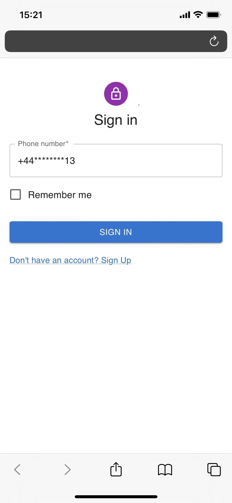
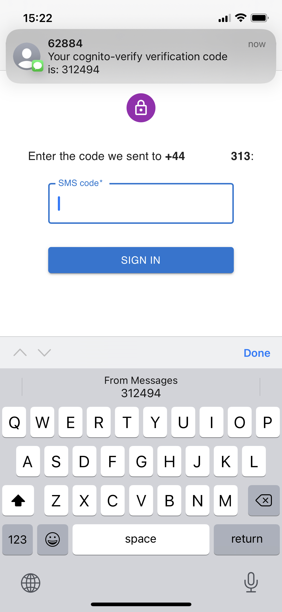
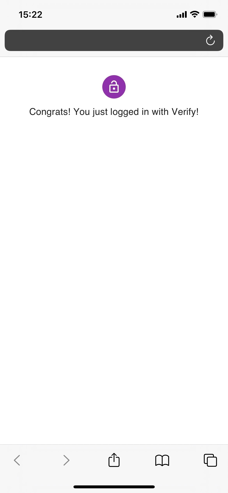

# Integrating AWS Cognito with Twilio Verify
Sample implementation for using Twilio Verify as an MFA provider for AWS Cognito. 

The solution relies on Cogito’s support for custom authentication flows via [lambda triggers](https://docs.aws.amazon.com/cognito/latest/developerguide/user-pool-lambda-challenge.html). 
In this scenario Cognito invokes several lambda functions which in turn call the Verify APIs to generate, send and verify OTPs. 
Please note, the hosted UI does not support custom authentication flows, so a custom UI is required.  

## Architecture

## Setup

*The setup of this solution involves configuring a custom authentication flow for a Cognito User Pool, using Lambda triggers. For an in-depth explanation, please refer to the [AWS documentation](https://docs.aws.amazon.com/cognito/latest/developerguide/user-pool-lambda-challenge.html).*

1. Create a [Twilio Verify](https://www.twilio.com/docs/verify) service.
2. Store your Twilio auth token as an SSM Parameter.
3. Deploy the `createAuthChallenge` lambda function. Set the following environment variables in the function's configuration:
    - `TWILIO_ACCOUNT_SID` - Twilio accound sid
    - `TWILIO_TOKEN` - path of parameter containing the Twilio token.
    - `VERIFY_SERVICE_SID` - SID of the Twilio Verify service from step 1. 
4. Deploy the `defineAuthChallenge` lambda function.
5. Deploy the `verifyAuthChallengeResponse` lambda function. Set the following environment variables in the function's configuration:
    - `TWILIO_ACCOUNT_SID` - Twilio accound sid
    - `TWILIO_TOKEN` - path of parameter containing the Twilio token.
    - `VERIFY_SERVICE_SID` - SID of the Twilio Verify service from step 1. 
6. Update your Cognito user pool and configure its `Define Auth challenge Lambda trigger`, `Create Auth challenge Lambda trigger` and `Verify Auth challenge response Lambda trigger` triggers to point to the lambda functions created in step 1, 2 and 3, respectively. 

## Demo

  
   
  

The above screenshots are from a passwordless authentication demo built on top of this AWS Cognito and Twilio Verify integration.
 passwordless

## Maintainer
Thanks for reading this far!
If you have any questions, do not hesitate to reach out at `hello@slintab.dev`
